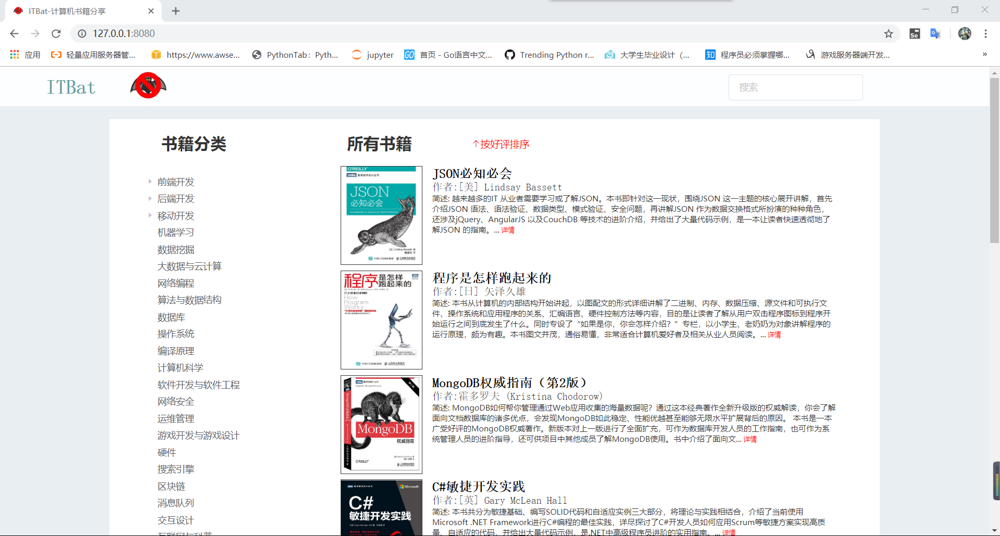
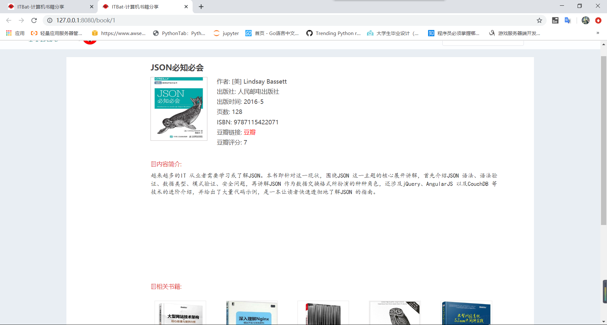
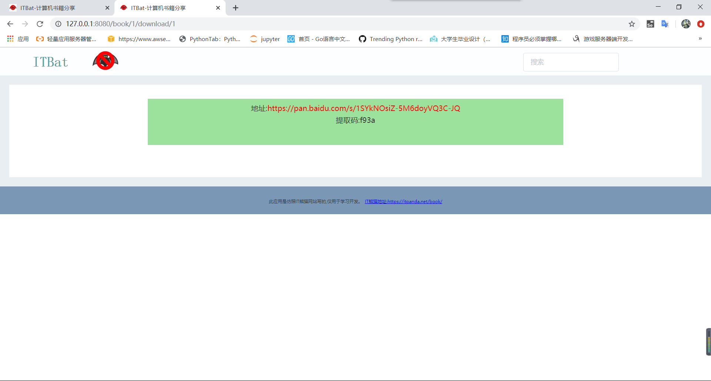

# ITBat
### 一个仿写[IT熊猫](https://itpanda.net/)的网站  
技术栈:  
数据获取:Python+Scrapy  
前端: Vue+ElementUI  
后端: Go+Gin+Gorm  

## 网站展示
  
  
 

## 项目构成
#### 1.数据获取:
  DataCrawl文件夹
#### 2.数据整理/修改:
  DataCleaning文件夹
#### 3.前端代码
  Front文件夹
#### 4.后端代码
  Backed文件夹
 
## 计划完成
1.练习编写中间件对数据接口进行适当加密  
2.练习编写中间件进行限流  
3.使用redis来缓存频繁访问的数据  
4.在获取资源的接口添加验证码

